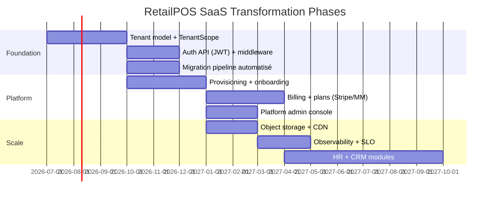

# RetailPOS Enterprise Software Engineering Blueprint

**Version:** 1.0  
**Statut:** Draft — Spécification d'ingénierie  
**Date:** Juin 2026  
**Produit:** RetailPOS → RetailPOS Cloud (SaaS Enterprise ERP)

---

## Objectif du document

Ce blueprint transforme RetailPOS d'une application **multi-magasin monolithique** en une plateforme **SaaS multi-tenant** de niveau entreprise. Il sert de référence unique pour :

- Product owners & investisseurs (vision, ROI, roadmap)
- Architectes & lead developers (décisions techniques)
- Équipes module (POS, WMS, Compta, etc.)
- DevOps & QA (déploiement, tests, observabilité)
- Partenaires d'intégration (API, webhooks)

> **Principe directeur :** Évoluer par **modular monolith** d'abord, extraire en microservices uniquement quand la charge ou l'équipe le justifie.

---

## État actuel (baseline v0.x)

| Dimension | État RetailPOS aujourd'hui |
|-----------|---------------------------|
| Architecture | PHP monolithique, 7 portails web (`admin`, `cashier`, `manager`, `warehouse`, `accounting`, `cash-registers`, `notifications`) |
| Données | MySQL unique `pos_system_db`, scope **magasin** via `StoreScope` |
| Auth | Sessions PHP + CSRF + remember-me ; JWT configuré mais non utilisé |
| API | `api/v1/index.php?request={resource}/{action}` — 15 ressources |
| RBAC | 11 rôles enterprise, 40+ permissions (`PermissionService`) |
| Offline | Sync queue + PWA partielle (POS) |
| i18n | EN + FR |
| SaaS | ❌ Pas de tenant, billing, ni provisioning |

---

## Index des volumes

| Vol. | Titre | Fichier | Audience principale |
|------|-------|---------|---------------------|
| 1 | Product Vision & Business Requirements | [VOLUME-01-product-vision.md](./VOLUME-01-product-vision.md) | PO, Business, Investisseurs |
| 2 | Software Architecture | [VOLUME-02-software-architecture.md](./VOLUME-02-software-architecture.md) | Architectes, Tech Leads |
| 3 | Database & Multi-Tenant Design | [VOLUME-03-database-multitenant.md](./VOLUME-03-database-multitenant.md) | DBA, Backend |
| 4 | Authentication, Security & RBAC | [VOLUME-04-auth-security-rbac.md](./VOLUME-04-auth-security-rbac.md) | Security, Backend |
| 5 | ERP Modules | [VOLUME-05-erp-modules.md](./VOLUME-05-erp-modules.md) | Équipes métier |
| 6 | SaaS Platform | [VOLUME-06-saas-platform.md](./VOLUME-06-saas-platform.md) | Platform, Product |
| 7 | API & Integrations | [VOLUME-07-api-integrations.md](./VOLUME-07-api-integrations.md) | API, Partenaires |
| 8 | PWA, Desktop & Mobile Strategy | [VOLUME-08-pwa-mobile.md](./VOLUME-08-pwa-mobile.md) | Frontend, Mobile |
| 9 | DevOps, Testing & Deployment | [VOLUME-09-devops-testing.md](./VOLUME-09-devops-testing.md) | DevOps, QA |
| 10 | Documentation, Coding Standards & Maintenance | [VOLUME-10-documentation-standards.md](./VOLUME-10-documentation-standards.md) | Tous développeurs |

---

## Roadmap de transformation (macro)

### Phase 0 — Stabilisation (en cours)
- Portails standalone (warehouse, accounting, cash-registers) ✅
- Alertes dashboard unifiées ✅
- Documentation module (`docs/`) ✅

### Phase 1 — Fondation SaaS (Q3–Q4 2026)
- Table `tenants` + `tenant_id` sur tables domaine
- `TenantScope` (extension de `StoreScope`)
- Séparation Platform Admin / Tenant Admin
- JWT + API keys pour intégrations

### Phase 2 — Plateforme (Q1–Q2 2027)
- Self-service signup + provisioning
- Plans & entitlements
- Facturation (Stripe + Mobile Money)
- White-label (logo, couleurs, domaine custom)

### Phase 3 — Scale & ERP complet (Q3 2027+)
- HR, CRM, achats fournisseurs avancés
- Marketplace d'intégrations
- Mobile natif (optionnel)
- Sharding / read replicas si nécessaire

---

## Glossaire

| Terme | Définition |
|-------|------------|
| **Tenant** | Organisation cliente SaaS (une entreprise retail). Contient N magasins. |
| **Store / Branch** | Point de vente ou entrepôt au sein d'un tenant. |
| **Workspace** | Portail UI (admin, cashier, warehouse, etc.) |
| **Platform Admin** | Opérateur RetailPOS Cloud (nous) — tous les tenants |
| **Tenant Admin** | Administrateur de l'organisation cliente |
| **Entitlement** | Fonctionnalité activée par le plan d'abonnement |
| **Scope** | Filtre de données (tenant → store → warehouse) |

---

## Conventions documentaires

- **MUST** = exigence obligatoire  
- **SHOULD** = fortement recommandé  
- **MAY** = optionnel  
- Les chemins de code référencent la racine du repo (`includes/`, `public/`, `api/`).  
- Chaque volume peut évoluer indépendamment ; le numéro de version du blueprint est **semver** (1.0 → 1.1 pour ajouts mineurs).

---

## Documents connexes existants

| Document | Emplacement |
|----------|-------------|
| Multi-store | `MULTI_STORE.md` |
| Notifications | `docs/NOTIFICATIONS.md` |
| Accounting | `docs/accounting/README.md` |
| Warehouse | `docs/warehouse/README.md` |
| Cash Registers | `docs/cash-registers/README.md` |
| Manager Supervision | `docs/manager-supervision/ARCHITECTURE.md` |
| i18n | `docs/I18N_README.md` |

---

*RetailPOS Enterprise Software Engineering Blueprint v1.0 — Mahadi227 / RetailPOS Team*
