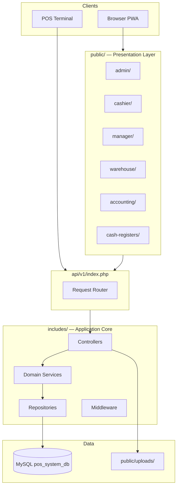
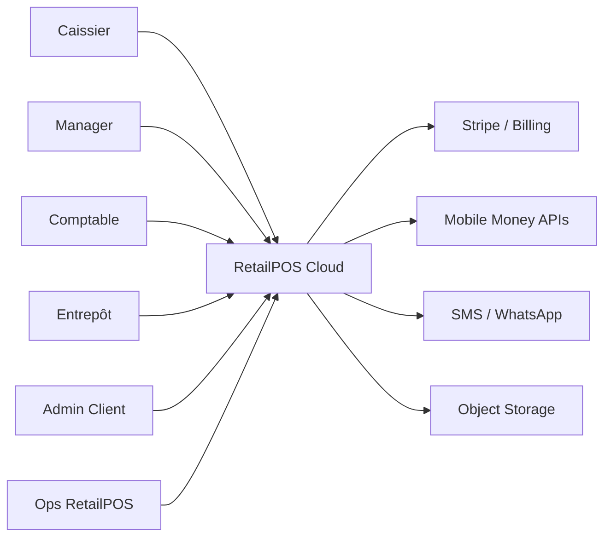
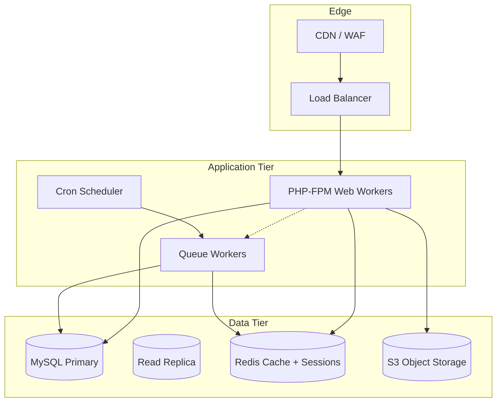
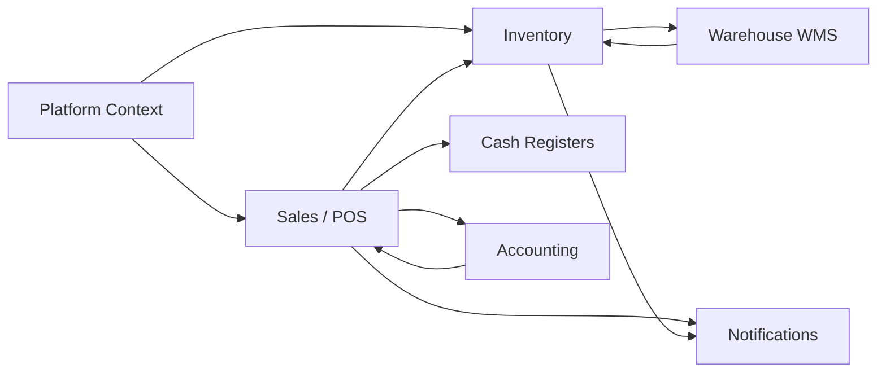

# Volume 2 — Software Architecture

**Blueprint:** RetailPOS Enterprise v1.0  
**Statut:** Draft

---

## 1. Objectif architectural

Définir l'architecture cible pour RetailPOS Cloud : **modular monolith évolutif** vers services découplés si nécessaire, en préservant la vélocité de développement actuelle (PHP vanilla + JS modules).

---

## 2. État actuel (As-Is)



### 2.1 Points forts existants

| Pattern | Implémentation |
|---------|----------------|
| Portails par workspace | `public/{portal}/includes/bootstrap.php` + `RbacGuard::workspace()` |
| Domain modules | `includes/Accounting/`, `CashRegister/`, `Wms/`, `Manager/`, `Notifications/` |
| Repository layer | `*Repository.php` dans chaque module |
| Scope données | `StoreScope` — filtre SQL magasin |
| API centralisée | 15 ressources dans `api/v1/index.php` |
| i18n | `languages/{lang}/*.php` + `__t()` |

### 2.2 Dette technique identifiée

| Problème | Fichier / zone | Impact SaaS |
|----------|----------------|-------------|
| Router monolithique | `api/v1/index.php` switch géant | Difficile à versionner / rate-limit |
| Pas de DI container | Instanciation manuelle controllers | Tests, mocking |
| JWT non utilisé | `config.php` JWT_SECRET | Pas d'API machine-to-machine |
| Uploads locaux | `public/uploads/` | Non scalable multi-instance |
| Migrators ad-hoc | `*SchemaMigrator.php` | Pas de versioning tenant-safe |
| Legacy redirects | `public/admin/warehouse/` | Confusion déploiement |

---

## 3. Architecture cible (To-Be)

### 3.1 Style architectural

**Décision ADR-001 :** Modular Monolith avec boundaries par bounded context.

| Option | Choix | Raison |
|--------|-------|--------|
| Microservices immédiats | ❌ | Équipe petite, overhead ops |
| Monolithe plat | ❌ | Dette déjà visible |
| **Modular monolith** | ✅ | Modules isolés, extraction future possible |
| Serverless | ❌ | PHP legacy, cold start POS |

### 3.2 Vue C4 — Niveau Contexte



### 3.3 Vue C4 — Niveau Conteneurs



---

## 4. Couches applicatives

### 4.1 Presentation Layer (`public/`)

| Responsabilité | Règle |
|----------------|-------|
| Rendu HTML | PHP templates dans chaque portail |
| Assets statiques | `assets/css/`, `assets/js/` versionnés (`?v=N`) |
| Auth guard | `bootstrap.php` → `RbacGuard::workspace()` |
| **Interdit** | Requêtes SQL directes dans les vues |

**Évolution SaaS :**
- Nouveau portail `public/platform/` (Platform Admin)
- Tenant branding injecté via `TenantSettings` (logo, accent color, CSS vars)
- Sous-domaine `{tenant}.retailpos.cloud` ou path `/t/{slug}/`

### 4.2 API Layer (`api/`)

| Version | Path | Auth |
|---------|------|------|
| v1 (actuel) | `api/v1/index.php?request=` | Session cookie |
| **v2 (cible)** | `api/v2/{resource}` | JWT Bearer + API Key |

**Middleware chain cible (ordre) :**
1. `TenantResolver` — identifie tenant (subdomain, header `X-Tenant-ID`, JWT claim)
2. `RateLimiter` — par tenant + IP
3. `AuthMiddleware` — session ou JWT
4. `EntitlementMiddleware` — module autorisé par plan
5. `StoreScopeMiddleware` — contexte magasin actif
6. Controller

### 4.3 Domain Layer (`includes/`)

Structure cible par bounded context :

```
includes/
├── Platform/           # NEW — tenants, billing, provisioning
│   ├── Repositories/
│   ├── Services/
│   └── TenantScope.php
├── Sales/              # Extraction future de SalesController
├── Inventory/
├── Accounting/         # ✅ Existe
├── CashRegister/       # ✅ Existe
├── Wms/                # ✅ Existe
├── Warehouse/          # ✅ Portal services
├── Manager/            # ✅ Existe
├── Notifications/      # ✅ Existe
├── Hr/                 # NEW — Phase 3
├── Crm/                # NEW — Phase 3
└── Shared/
    ├── Events/
    ├── ValueObjects/
    └── Contracts/
```

### 4.4 Infrastructure Layer

| Composant | Actuel | Cible |
|-----------|--------|-------|
| Database | PDO singleton | PDO + connection pool, read/write split |
| Cache | Aucun | Redis (sessions, permissions, catalog) |
| Queue | Sync inline | Redis queue (notifications, exports, webhooks) |
| Storage | Filesystem | S3-compatible (`tenant/{id}/...`) |
| Search | SQL LIKE | Meilisearch/Elasticsearch (optionnel Y2) |

---

## 5. Bounded Contexts & dépendances



**Règle :** Communication inter-context via **Services** ou **Domain Events** — jamais d'accès direct Repository cross-module.

---

## 6. Multi-tenancy dans l'architecture

### 6.1 Tenant Context propagation

```php
// Cible : includes/Platform/TenantScope.php
final class TenantScope
{
    public static function id(): int;
    public static function slug(): string;
    public static function sqlFilter(string $alias = ''): string;
    public static function assertResource(int $tenantId): void;
}
```

Chaque requête HTTP/API MUST résoudre le tenant avant tout accès données.

### 6.2 Résolution tenant (priorité)

| # | Méthode | Usage |
|---|---------|-------|
| 1 | Sous-domaine | `acme.retailpos.cloud` |
| 2 | Header API | `X-Tenant-ID: uuid` |
| 3 | JWT claim | `tenant_id` dans payload |
| 4 | Session | `$_SESSION['tenant_id']` post-login |
| 5 | Path prefix | `/t/acme/admin/` (fallback) |

---

## 7. Événements domaine (Event-Driven interne)

### 7.1 Bus d'événements (Phase 2)

| Événement | Producteurs | Consommateurs |
|-----------|-------------|---------------|
| `SaleCompleted` | Sales | Accounting (auto-post), Inventory, Notifications |
| `StockBelowThreshold` | Inventory | Notifications, Purchasing |
| `TransferApproved` | WMS | Inventory, Notifications |
| `PaymentReceived` | CashRegister | Accounting |
| `TenantProvisioned` | Platform | Seed data, Email welcome |

**Implémentation initiale :** Table `domain_events` + worker PHP (pas Kafka au départ).

---

## 8. Stratégie de découpage microservices (future)

Extraire en premier (si charge justifie) :

1. **Notification Service** — envoi SMS/email/WhatsApp
2. **Sync Service** — offline push/pull (haute charge)
3. **Reporting Service** — exports lourds, BI

Critères d'extraction :
- Charge CPU > 30 % du monolithe
- Cycle de release indépendant requis
- Équipe dédiée ≥ 2 devs

---

## 9. Décisions techniques (ADR summary)

| ID | Décision | Statut |
|----|----------|--------|
| ADR-001 | Modular monolith | Accepté |
| ADR-002 | MySQL shared DB + tenant_id | Accepté (Vol. 3) |
| ADR-003 | Redis sessions + cache | Proposé |
| ADR-004 | S3 object storage | Proposé |
| ADR-005 | API v2 REST + OpenAPI | Proposé |
| ADR-006 | PHP 8.2+ minimum | Proposé |
| ADR-007 | Pas de framework PHP full (Laravel) | Accepté — migration trop coûteuse |

---

## 10. Structure déploiement logique

```
retailpos-cloud/
├── web/          # public/ + api/ (stateless)
├── worker/       # queue consumers
├── scheduler/    # cron (billing, cleanup, reports)
└── migrator/     # CLI migrations tenant-aware
```

---

## 11. Checklist migration architecture

- [ ] Créer `includes/Platform/` avec `TenantScope`
- [ ] Extraire middleware tenant de `RbacGuard`
- [ ] Refactorer `api/v1/index.php` → controllers + route table
- [ ] Introduire `api/v2/` avec JWT
- [ ] Redis pour sessions (multi-instance)
- [ ] Abstraire storage → interface `FileStorage` (local/S3)
- [ ] Event dispatcher minimal
- [ ] Supprimer legacy redirects après période de grâce

---

*Volume 2 — RetailPOS Enterprise Blueprint v1.0*
