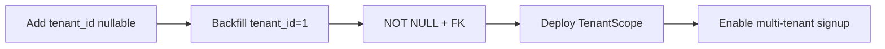

# Volume 3 — Database & Multi-Tenant Design

**Blueprint:** RetailPOS Enterprise v1.0  
**Statut:** Draft

---

## 1. Objectif

Concevoir le modèle de données **multi-tenant** pour RetailPOS Cloud en migrant depuis le modèle **multi-magasin** actuel (`stores`, `StoreScope`), sans perte de données ni régression fonctionnelle.

---

## 2. État actuel (As-Is)

### 2.1 Base de données

| Attribut | Valeur |
|----------|--------|
| SGBD | MySQL 8.0+ / MariaDB 10.6+ |
| Charset | `utf8mb4_unicode_ci` |
| Base | `pos_system_db` (unique) |
| Schéma base | `includes/Database/schema.sql` |
| Migrations | `includes/Database/migrations/001`–`018` |
| Accès | `Database::getInstance()->getConnection()` (PDO singleton) |

### 2.2 Hiérarchie données actuelle

```
Organization (implicite — une seule)
└── Store (stores)
    ├── Products (store_id)
    ├── Sales (store_id)
    ├── Users (store_id + user_stores)
    ├── Warehouses (liés aux stores)
    └── Cash Registers (store_id)
```

### 2.3 StoreScope (référence)

Fichier : `includes/Helpers/StoreScope.php`

| Méthode | Rôle |
|---------|------|
| `activeStoreId()` | Magasin actif en session |
| `accessibleStoreIds()` | Magasins autorisés pour l'utilisateur |
| `sqlFilter($alias)` | Clause `AND store_id IN (...)` |
| `isGlobalView()` | Super admin sans magasin actif |
| `resolveStoreId($input)` | Validation store dans requête |

**Limite SaaS :** Aucun `tenant_id` — toutes les organisations partagent les mêmes tables.

---

## 3. Stratégies multi-tenant — analyse

| Stratégie | Isolation | Coût | Complexité | Verdict |
|-----------|-----------|------|------------|---------|
| **A. Shared DB + tenant_id** | Moyenne (RLS app) | Faible | Faible | ✅ **Recommandé Phase 1–2** |
| B. Schema per tenant | Forte | Moyen | Moyen | Option Enterprise |
| C. Database per tenant | Très forte | Élevé | Élevé | Gros comptes uniquement |
| D. Hybrid (A + C) | Flexible | Variable | Élevé | Phase 3+ |

**Décision ADR-002 :** Stratégie A pour le lancement SaaS, avec option migration vers C pour clients Enterprise sur demande.

---

## 4. Modèle cible (To-Be)

### 4.1 Hiérarchie

```
Platform (RetailPOS Cloud)
└── Tenant (organizations)
    ├── Subscription / Plan
    ├── Stores (branches)
    │   ├── Products
    │   ├── Sales
    │   ├── Cash Registers
    │   └── Warehouses
    ├── Users (tenant-scoped)
    └── Settings (branding, fiscal, locale)
```

### 4.2 Nouvelles tables cœur

```sql
-- Migration 019_tenant_foundation.sql (proposition)

CREATE TABLE tenants (
    id              BIGINT UNSIGNED AUTO_INCREMENT PRIMARY KEY,
    uuid            CHAR(36) NOT NULL UNIQUE,
    slug            VARCHAR(63) NOT NULL UNIQUE,
    name            VARCHAR(255) NOT NULL,
    legal_name      VARCHAR(255) NULL,
    country_code    CHAR(2) NOT NULL DEFAULT 'SN',
    timezone        VARCHAR(64) NOT NULL DEFAULT 'Africa/Dakar',
    default_currency VARCHAR(8) NOT NULL DEFAULT 'XOF',
    status          ENUM('trial','active','suspended','cancelled') NOT NULL DEFAULT 'trial',
    plan_id         BIGINT UNSIGNED NULL,
    trial_ends_at   DATETIME NULL,
    settings_json   JSON NULL,
    created_at      DATETIME NOT NULL DEFAULT CURRENT_TIMESTAMP,
    updated_at      DATETIME NOT NULL DEFAULT CURRENT_TIMESTAMP ON UPDATE CURRENT_TIMESTAMP,
    deleted_at      DATETIME NULL,
    INDEX idx_tenants_status (status),
    INDEX idx_tenants_slug (slug)
);

CREATE TABLE subscription_plans (
    id              BIGINT UNSIGNED AUTO_INCREMENT PRIMARY KEY,
    code            VARCHAR(32) NOT NULL UNIQUE,
    name            VARCHAR(128) NOT NULL,
    max_stores      INT UNSIGNED NULL,
    max_users       INT UNSIGNED NULL,
    modules_json    JSON NOT NULL,
    price_monthly   DECIMAL(12,2) NOT NULL,
    currency        CHAR(3) NOT NULL DEFAULT 'EUR',
    is_active       TINYINT(1) NOT NULL DEFAULT 1
);

CREATE TABLE tenant_subscriptions (
    id              BIGINT UNSIGNED AUTO_INCREMENT PRIMARY KEY,
    tenant_id       BIGINT UNSIGNED NOT NULL,
    plan_id         BIGINT UNSIGNED NOT NULL,
    status          ENUM('active','past_due','cancelled') NOT NULL,
    current_period_start DATE NOT NULL,
    current_period_end   DATE NOT NULL,
    external_id     VARCHAR(128) NULL,
    FOREIGN KEY (tenant_id) REFERENCES tenants(id)
);

CREATE TABLE platform_users (
    id              BIGINT UNSIGNED AUTO_INCREMENT PRIMARY KEY,
    email           VARCHAR(255) NOT NULL UNIQUE,
    password_hash   VARCHAR(255) NOT NULL,
    name            VARCHAR(255) NOT NULL,
    role            ENUM('platform_admin','support') NOT NULL,
    created_at      DATETIME NOT NULL DEFAULT CURRENT_TIMESTAMP
);
```

### 4.3 Extension tables existantes

**Pattern obligatoire** pour toutes les tables domaine :

```sql
ALTER TABLE stores ADD COLUMN tenant_id BIGINT UNSIGNED NOT NULL AFTER id;
ALTER TABLE stores ADD INDEX idx_stores_tenant (tenant_id);
ALTER TABLE stores ADD FOREIGN KEY (tenant_id) REFERENCES tenants(id);

-- Répéter pour : users, products, sales, sale_items, customers,
-- warehouses, cash_registers, journal_entries, notifications, etc.
```

### 4.4 Contraintes d'unicité tenant-scoped

| Table | Actuel | Cible |
|-------|--------|-------|
| `users.email` | UNIQUE global | UNIQUE `(tenant_id, email)` |
| `products.sku` | Par store | UNIQUE `(tenant_id, store_id, sku)` |
| `stores.code` | — | UNIQUE `(tenant_id, code)` |

---

## 5. TenantScope — design PHP

```php
// includes/Platform/TenantScope.php — spécification

final class TenantScope
{
    private static ?int $tenantId = null;

    public static function set(int $tenantId): void;
    public static function id(): int;
    public static function uuid(): string;

    /** Clause SQL : AND {alias}tenant_id = :tenant_id */
    public static function sqlFilter(string $tableAlias = ''): string;

    /** IDs magasins accessibles (délègue à StoreScope) */
    public static function accessibleStoreIds(): array;

    /** Vérifie qu'une ressource appartient au tenant courant */
    public static function assertOwnership(string $table, int $id): void;
}
```

**Règle MUST :** Tout `Repository` MUST appeler `TenantScope::sqlFilter()` ou équivalent paramétré.

---

## 6. Row-Level Security

### 6.1 Niveau application (Phase 1)

- `TenantScope` injecté dans chaque requête
- Code review rule : aucun `SELECT` sans filtre tenant
- Tests automatisés cross-tenant (PHPUnit)

### 6.2 Niveau MySQL (Phase 2 — optionnel)

```sql
-- MySQL 8.0 RLS via views ou security policies (si supporté)
CREATE VIEW v_products AS
SELECT * FROM products
WHERE tenant_id = CURRENT_TENANT_ID();
```

### 6.3 Audit anti-fuite

Table `security_audit_log` :
- `cross_tenant_attempt` — tentative accès ressource autre tenant
- `missing_tenant_filter` — détecté en dev par middleware debug

---

## 7. Plan de migration données

### Phase M1 — Préparation (sans downtime)

1. Créer tables `tenants`, `subscription_plans`
2. Insérer tenant par défaut `legacy` (id=1) pour données existantes
3. Ajouter `tenant_id` nullable sur toutes tables domaine
4. Backfill `tenant_id = 1` pour toutes lignes existantes
5. Rendre `tenant_id NOT NULL` + FK

### Phase M2 — Code

1. Implémenter `TenantScope`
2. Refactorer `StoreScope` : `tenant_id` puis `store_id`
3. Mettre à jour tous les Repositories (grep `store_id` → audit)
4. Session : `$_SESSION['tenant_id']` à login

### Phase M3 — Validation

1. Tests régression tous modules
2. Pen test cross-tenant
3. Performance benchmark (index `tenant_id` composites)



---

## 8. Indexation

### Index composites recommandés

```sql
-- Ventes par tenant + magasin + date
CREATE INDEX idx_sales_tenant_store_date
    ON sales (tenant_id, store_id, created_at);

-- Produits par tenant + magasin + SKU
CREATE INDEX idx_products_tenant_store_sku
    ON products (tenant_id, store_id, sku);

-- Users par tenant + email
CREATE UNIQUE INDEX idx_users_tenant_email
    ON users (tenant_id, email);
```

---

## 9. Schéma modules — inventaire tables

| Module | Tables clés | tenant_id requis |
|--------|-------------|------------------|
| Core | `tenants`, `stores`, `users`, `roles`, `permissions` | ✅ |
| POS | `sales`, `sale_items`, `payments`, `returns` | ✅ |
| Inventory | `products`, `categories`, `inventory_ledger`, `stock_adjustments` | ✅ |
| WMS | `warehouses`, `warehouse_inventory`, `transfers`, `dispatches`, `goods_receipts` | ✅ |
| Cash Registers | `cash_registers`, `cash_register_sessions`, `cash_movements` | ✅ |
| Accounting | `accounts`, `journal_entries`, `journal_lines`, `treasury_accounts` | ✅ |
| Notifications | `notifications`, `notification_preferences` | ✅ |
| Sync | `synchronization_queue`, `offline_transactions` | ✅ |
| Platform | `tenant_subscriptions`, `billing_events`, `usage_metrics` | N/A |

---

## 10. Backup & restore par tenant

| Opération | Approche |
|-----------|----------|
| Backup global | mysqldump nightly + binlog |
| Export tenant | Script CLI : tables filtrées par `tenant_id` → archive chiffrée |
| Import tenant | Provisioning wizard + import JSON/SQL |
| Suppression tenant | Soft delete + période rétention 30 j → purge |
| RGPD effacement | Anonymisation PII + hard delete sur demande |

---

## 11. Data residency

| Région | Hébergement cible | Notes |
|--------|-------------------|-------|
| Afrique de l'Ouest | AWS af-south-1 ou local (Senegal, CI) | Latence POS |
| EU | AWS eu-west-1 | Clients RGPD |
| Défaut | Région signup | Configurable Enterprise |

---

## 12. Migrations — pipeline cible

| Étape | Outil | Règle |
|-------|-------|-------|
| Versioning | Table `schema_migrations` | Numéro séquentiel |
| Exécution | CLI `php tools/migrate.php` | Idempotent |
| Tenant-safe | Migrations structure only | Pas de data par tenant |
| Rollback | Down scripts optionnels | Pour migrations critiques |
| CI | Migration dry-run sur DB test | Bloque merge si échec |

**Remplacer progressivement :** `*SchemaMigrator.php` runtime → migrations versionnées.

---

## 13. Checklist

- [ ] Migration 019 `tenants` + `subscription_plans`
- [ ] Script backfill `tenant_id`
- [ ] `TenantScope.php` + tests
- [ ] Audit tous repositories
- [ ] Index composites
- [ ] Export/import tenant CLI
- [ ] Documentation ERD mise à jour

---

*Volume 3 — RetailPOS Enterprise Blueprint v1.0*
