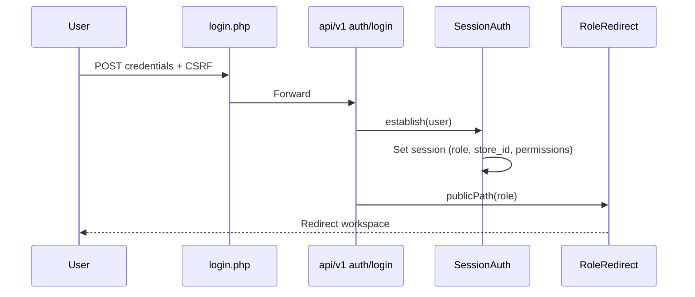
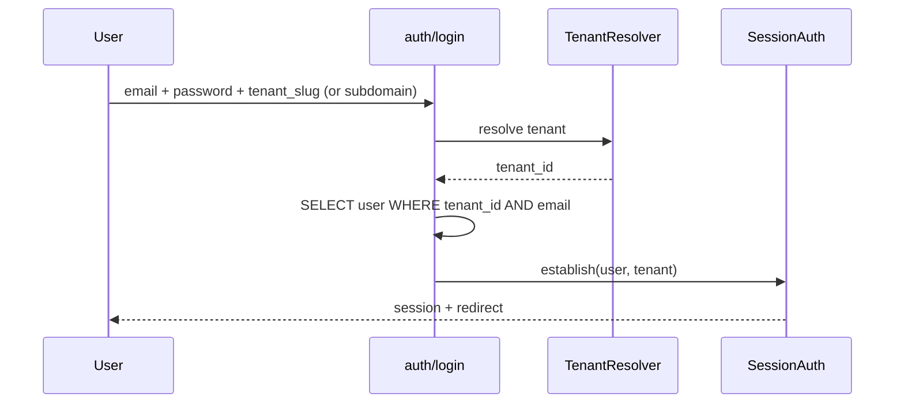

# Volume 4 — Authentication, Security & RBAC

**Blueprint:** RetailPOS Enterprise v1.0  
**Statut:** Draft

---

## 1. Objectif

Spécifier le modèle d'authentification, de sécurité et de contrôle d'accès pour RetailPOS Cloud — incluant la séparation **Platform Admin** vs **Tenant Admin**, l'auth API (JWT), et l'extension du RBAC existant.

---

## 2. État actuel (As-Is)

### 2.1 Composants auth

| Composant | Fichier | Rôle |
|-----------|---------|------|
| Sessions | `includes/Config/session.php` | Cookie `retailpos_session`, timeout 30 min |
| Session auth | `includes/Auth/SessionAuth.php` | Populate session post-login |
| Remember-me | `includes/Auth/RememberMeService.php` | Cookie 30 jours |
| Role routing | `includes/Auth/RoleRedirect.php` | Redirect par rôle |
| Page guard | `includes/Helpers/RbacGuard.php` | `workspace()`, `requirePermission()` |
| API guard | `includes/Middleware/AuthMiddleware.php` | `apiProtect($roles)` |
| Permissions | `includes/Auth/PermissionService.php` | Rôles + overrides `user_permissions` |
| CSRF | `session.php` | Token session |
| Audit | `includes/Auth/AuditLogger.php` | Events sécurité |
| JWT | `config.php` JWT_SECRET | **Configuré mais non utilisé** |

### 2.2 Flux login actuel



### 2.3 Rôles enterprise (migration 009)

| Rôle | Workspace défaut | Accès admin |
|------|------------------|-------------|
| `super_admin` | admin | Tous tenants (actuellement global) |
| `admin` | admin | Tenant |
| `manager` | manager | Tenant |
| `cashier` | cashier | Store |
| `staff` | cashier | Store |
| `warehouse_manager` | warehouse | Warehouse |
| `inventory_officer` | warehouse | Warehouse |
| `receiving_officer` | warehouse | Receiving |
| `dispatch_officer` | warehouse | Dispatch |
| `warehouse_auditor` | warehouse | Read-only |
| `storekeeper` | warehouse | Inventory |
| `accountant` | accounting | Finance |
| `customer` | customer | Stub |

---

## 3. Modèle cible — deux niveaux d'administration

### 3.1 Séparation Platform vs Tenant

| Niveau | Utilisateurs | Scope | Portail |
|--------|--------------|-------|---------|
| **Platform** | `platform_admin`, `support` | Tous tenants (métadonnées, billing) | `public/platform/` |
| **Tenant** | `super_admin`, `admin`, rôles métier | Un tenant | Portails existants |

**Changement critique :** Le rôle `super_admin` actuel (god mode cross-store) devient **Tenant Super Admin** — limité à son `tenant_id`. Le vrai super-admin plateforme est `platform_admin`.

### 3.2 Matrice workspace × rôle (cible)

Fichier de référence à étendre : `RoleRedirect::workspaceRoles()`

| Workspace | Rôles autorisés | + tenant_id requis |
|-----------|-----------------|-------------------|
| `platform` | `platform_admin`, `support` | Non (cross-tenant) |
| `admin` | `super_admin`, `admin`, `manager` | Oui |
| `manager` | `manager`, `admin`, `super_admin` | Oui |
| `cashier` | `cashier`, `staff`, + admins | Oui |
| `warehouse` | Rôles WMS + admin | Oui |
| `accounting` | `accountant`, `admin`, `super_admin` | Oui |
| `cash_registers` | `admin`, `manager`, `super_admin` | Oui |

---

## 4. Authentification cible

### 4.1 Modes d'auth

| Mode | Usage | Mécanisme |
|------|-------|-----------|
| **Session web** | Portails browser | Cookie HttpOnly, Secure, SameSite=Lax |
| **JWT Bearer** | API v2, mobile, intégrations | RS256, TTL 1 h + refresh token |
| **API Key** | Webhooks entrants, scripts | Header `X-API-Key`, scoped par tenant |
| **Remember-me** | UX web | Token rotatif en DB |

### 4.2 JWT payload (spec)

```json
{
  "sub": "user_uuid",
  "tenant_id": "tenant_uuid",
  "role": "admin",
  "store_id": 42,
  "permissions": ["sales.view", "inventory.edit"],
  "iat": 1718841600,
  "exp": 1718845200,
  "iss": "retailpos.cloud"
}
```

### 4.3 Login multi-tenant



**Règle :** Email unique **par tenant**, pas globalement.

### 4.4 MFA (Phase 2)

| Méthode | Priorité |
|---------|----------|
| TOTP (Google Authenticator) | P1 |
| SMS OTP | P1 (Afrique) |
| Email OTP | P2 |
| WebAuthn / FIDO2 | P3 |

Obligatoire pour : `platform_admin`, `super_admin` tenant (configurable).

---

## 5. RBAC — modèle de permissions

### 5.1 Structure

```
Tenant
└── Roles (system + custom)
    └── Permissions (granular)
        └── user_permissions (overrides +/-)
```

### 5.2 Format permission

`{module}.{resource}.{action}`

Exemples existants à formaliser :
- `sales.create`, `sales.void`, `sales.discount.approve`
- `inventory.adjust`, `inventory.transfer`
- `warehouse.dispatch`, `warehouse.receive`
- `accounting.journal.post`
- `cash_registers.reconcile`
- `users.manage`, `stores.manage`
- `platform.tenants.manage` *(platform only)*

### 5.3 PermissionService — évolution

Fichier : `includes/Auth/PermissionService.php`

| Méthode cible | Rôle |
|---------------|------|
| `can(string $permission): bool` | Vérifie permission courante |
| `canAny(array $permissions): bool` | OR logic |
| `forUser(int $userId): array` | Liste effective |
| `invalidateCache(int $userId): void` | Redis cache permissions |

**Cache :** Permissions en Redis TTL 5 min, invalidation à changement rôle.

### 5.4 Entitlements (plan SaaS)

Couche au-dessus RBAC :

```php
EntitlementService::hasModule($tenantId, 'warehouse'); // plan + override
```

Un utilisateur MAY avoir la permission `warehouse.view` mais le module MAY être désactivé par plan → **403 Module not subscribed**.

---

## 6. Sécurité — contrôles obligatoires

### 6.1 OWASP Top 10 — mapping

| Risque | Mitigation RetailPOS |
|--------|---------------------|
| Injection SQL | PDO prepared statements (existant) |
| Broken Auth | Session regen, MFA, rate limit login |
| Sensitive Data | TLS, encrypt PII at rest |
| XXE | Pas de XML parsing externe |
| Broken Access | TenantScope + RBAC + tests |
| Misconfig | Hardening PHP, headers sécurité |
| XSS | `htmlspecialchars()` sorties, CSP |
| Insecure Deserialization | Pas de `unserialize` user input |
| Known Vulnerabilities | Dependabot, `composer audit` |
| Logging | AuditLogger + centralisation |

### 6.2 Headers HTTP (MUST)

```
Strict-Transport-Security: max-age=31536000
X-Content-Type-Options: nosniff
X-Frame-Options: DENY
Content-Security-Policy: default-src 'self'; ...
Referrer-Policy: strict-origin-when-cross-origin
```

### 6.3 Rate limiting

| Endpoint | Limite |
|----------|--------|
| `auth/login` | 5/min/IP, 20/min/tenant |
| API générale | 1000/min/tenant (plan dependent) |
| Export reports | 10/h/tenant |

### 6.4 Chiffrement

| Donnée | Méthode |
|--------|---------|
| Mots de passe | `password_hash()` bcrypt/argon2 |
| API keys | SHA-256 hash en DB, prefix visible |
| PII sensible | AES-256-GCM colonne (optionnel) |
| Backups | Chiffrement at rest (S3 SSE) |

---

## 7. Audit & conformité

### 7.1 Événements audités (MUST)

| Catégorie | Exemples |
|-----------|----------|
| Auth | login, logout, failed login, MFA, password change |
| Authorization | permission denied, cross-tenant attempt |
| Sales | void, discount > seuil, return |
| Inventory | adjustment, transfer approve |
| Admin | user create/delete, role change, plan change |
| Platform | tenant suspend, data export |

Table cible : `audit_logs` (existe partiellement via `AuditLogger` — unifier).

### 7.2 Rétention

| Type | Durée |
|------|-------|
| Audit sécurité | 2 ans minimum |
| Audit ventes | 7 ans (fiscal) |
| Logs applicatifs | 90 jours |
| Sessions | 30 jours max |

---

## 8. Isolation session multi-instance

**Problème :** Sessions fichiers PHP ne scalent pas horizontalement.

**Solution :** Redis session handler

```php
// config cible
ini_set('session.save_handler', 'redis');
ini_set('session.save_path', 'tcp://redis:6379?prefix=retailpos_sess:');
```

---

## 9. API Keys & intégrations

### Table `api_keys`

```sql
CREATE TABLE api_keys (
    id BIGINT UNSIGNED AUTO_INCREMENT PRIMARY KEY,
    tenant_id BIGINT UNSIGNED NOT NULL,
    name VARCHAR(128) NOT NULL,
    key_prefix VARCHAR(8) NOT NULL,
    key_hash VARCHAR(64) NOT NULL,
    scopes JSON NOT NULL,
    last_used_at DATETIME NULL,
    expires_at DATETIME NULL,
    created_by BIGINT UNSIGNED NOT NULL,
    revoked_at DATETIME NULL
);
```

Scopes exemples : `sales:read`, `inventory:write`, `webhooks:manage`

---

## 10. Checklist sécurité SaaS

- [ ] Séparer `platform_admin` de `super_admin` tenant
- [ ] Implémenter JWT v2 + refresh tokens
- [ ] Email unique par tenant
- [ ] TenantResolver au login
- [ ] Redis sessions
- [ ] Rate limiting login
- [ ] MFA pour admins
- [ ] EntitlementMiddleware
- [ ] Tests cross-tenant automatisés
- [ ] Pen test avant GA SaaS

---

*Volume 4 — RetailPOS Enterprise Blueprint v1.0*
