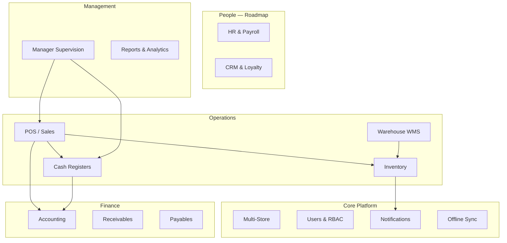

# Volume 5 — ERP Modules

**Blueprint:** RetailPOS Enterprise v1.0  
**Statut:** Draft

---

## 1. Objectif

Documenter chaque module ERP de RetailPOS Cloud : périmètre fonctionnel, état actuel, architecture code, dépendances, et roadmap SaaS.

---

## 2. Vue d'ensemble modules



---

## 3. Module POS / Sales

### 3.1 Statut : ✅ Production

| Attribut | Détail |
|----------|--------|
| Portail | `public/cashier/` — `pos.php` |
| API | `SalesController`, `CashierController` |
| Frontend | `assets/js/cashier/pos-app.js`, `assets/js/pos/` |
| Offline | `SyncController` push/pull |

### 3.2 Fonctionnalités

| Feature | Statut | Notes |
|---------|--------|-------|
| Vente comptoir | ✅ | Panier, paiements multiples |
| Scanner code-barres | ✅ | `barcode-scanner.js` |
| Clients | ✅ | `customers` store-scoped |
| Remises | ✅ | Approbation manager |
| Retours | ✅ | `returns.php` |
| Reçu thermique | ✅ | `receipts/templates/thermal-80mm.php` |
| Hold / reprise ticket | ⚠️ | À renforcer offline |
| Mode formation | ❌ | Roadmap |
| Self-checkout | ❌ | Phase 3 |

### 3.3 Exigences SaaS

- [ ] `tenant_id` sur `sales`, `sale_items`, `payments`
- [ ] Numérotation facture par tenant
- [ ] Entitlement : max transactions/mois (plan Starter)
- [ ] PWA offline 72 h certifié

---

## 4. Module Inventory

### 4.1 Statut : ✅ Production

| Attribut | Détail |
|----------|--------|
| Portail | `public/admin/inventory.php`, analytics, reports, history |
| API | `InventoryController`, `InventoryLedgerController` |
| Ledger | Migration `006_inventory_ledger.sql` |

### 4.2 Fonctionnalités

| Feature | Statut |
|---------|--------|
| Catalogue produits | ✅ |
| Catégories store-scoped | ✅ (011) |
| Stock movements | ✅ |
| Stock transfers inter-magasins | ✅ |
| Ajustements | ✅ |
| Inventaire physique | ✅ |
| Alertes stock bas | ✅ |
| Valorisation stock | ⚠️ WMS reports |
| Lots / péremption | ✅ via WMS |
| Coût moyen pondéré | ⚠️ Accounting link |

### 4.3 Intégrations

- Vente POS → décrément stock (temps réel)
- WMS réception → incrément
- Comptabilité → écriture stock (AutoPostingService)

---

## 5. Module Warehouse (WMS)

### 5.1 Statut : ✅ Production

| Attribut | Détail |
|----------|--------|
| Portail | `public/warehouse/` (~50 pages) |
| API | `WmsController`, `WarehousePortalController` |
| Auth | `WarehousePortalAuth.php` |
| Schema | Migration `008_wms.sql`, `015_warehouse_portal.sql` |

### 5.2 Sous-modules

| Sous-module | Pages | Rôles |
|-------------|-------|-------|
| Receiving | `receiving/*` | receiving_officer, warehouse_manager |
| Dispatch | `dispatch/*` | dispatch_officer |
| Transfers | `transfers/*` | inventory_officer, storekeeper |
| Inventory | `inventory/*` | inventory_officer |
| Batch/Serial | `batch/*` | inventory_officer |
| Reports | `reports/*` | warehouse_auditor, manager |
| Management | `management/*` | warehouse_manager, admin |

### 5.3 Fonctionnalités clés

- Purchase orders → goods receipts → quality inspection
- FIFO/FEFO, expiry management, serial numbers
- Dispatch orders → pick → pack → ship → delivery confirmation
- Inter-warehouse & branch transfers
- Barcode scanner, stock count
- Performance & valuation reports

### 5.4 SaaS

- Entitlement module `wms` (plan Enterprise)
- `tenant_id` sur toutes tables WMS
- Retour Admin sidebar ✅ (`wh_back_admin`)

---

## 6. Module Cash Registers (Caisses)

### 6.1 Statut : ✅ Production

| Attribut | Détail |
|----------|--------|
| Portail | `public/cash-registers/` (standalone) |
| Legacy | `public/admin/cash_registers/` → redirects |
| API | `CashRegisterController` |
| Schema | Migration `007_cash_registers.sql` |

### 6.2 Fonctionnalités

| Feature | Statut |
|---------|--------|
| Registres caisse | ✅ |
| Ouverture / fermeture session | ✅ |
| Mouvements espèces | ✅ |
| Transferts inter-caisses | ✅ |
| Réconciliation | ✅ |
| Shifts | ✅ |
| Analytics | ✅ |
| Logs audit | ✅ |
| Lien POS | ✅ |

---

## 7. Module Accounting

### 7.1 Statut : ✅ Beta

| Attribut | Détail |
|----------|--------|
| Portail | `public/accounting/` |
| API | `AccountingController` |
| Backend | `includes/Accounting/` |
| Schema | Migration `014_accounting.sql` |

### 7.2 Fonctionnalités

| Feature | Statut |
|---------|--------|
| Chart of accounts | ✅ |
| Journal entries | ✅ |
| Auto-posting ventes | ✅ `AutoPostingService` |
| Trésorerie (cash, bank, mobile money) | ✅ |
| AR / AP | ✅ |
| Expenses / Revenues | ✅ |
| P&L, Balance Sheet, Cashflow | ✅ |
| Inventory accounting | ✅ |
| Audit logs compta | ✅ |
| Export FEC / fiscal local | ❌ Roadmap |
| Multi-devise consolidation | ⚠️ Partiel |

### 7.3 Plan comptable

- Plan type OHADA / SYSCOHADA configurable par tenant (Afrique)
- Mapping automatique comptes POS → GL

---

## 8. Module Manager / Supervision

### 8.1 Statut : ✅ Production

| Attribut | Détail |
|----------|--------|
| Portail | `public/manager/` |
| API | `ManagerController` |
| Services | `SupervisionService`, `ApprovalService`, `ShiftService` |

### 8.2 Fonctionnalités

- Supervision caisses live
- Approbations : retours, remises, voids
- Gestion équipes / shifts
- Rapports opérationnels
- Audit trail manager

---

## 9. Module Notifications

### 9.1 Statut : ✅ Production

| Attribut | Détail |
|----------|--------|
| Docs | `docs/NOTIFICATIONS.md` |
| API | `NotificationController` |
| Channels | In-app, email, browser push, WhatsApp (013) |

### 9.2 Types

- Stock bas, sync errors, approvals pending
- WMS events (transfer, dispatch)
- Cash register anomalies
- Configurable par utilisateur (preferences)

---

## 10. Module HR — Roadmap (Phase 3)

### 10.1 Périmètre proposé

| Feature | Priorité |
|---------|----------|
| Fiche employé liée `users` | P0 |
| Planning / pointage | P1 |
| Congés | P2 |
| Paie basique | P2 |
| Commissions ventes | P1 |

### 10.2 Tables proposées

`employees`, `attendance`, `leave_requests`, `payroll_runs`, `commission_rules`

### 10.3 Intégrations

- Users existants → `employees.user_id`
- Manager shifts → extend
- Accounting → charges salariales

---

## 11. Module CRM — Roadmap (Phase 2–3)

### 11.1 État actuel

- Table `customers` store-scoped ✅
- Pas de fidélité, campagnes, pipeline

### 11.2 Périmètre proposé

| Feature | Priorité |
|---------|----------|
| Profil client enrichi | P0 |
| Historique achats | P0 (lien sales) |
| Points fidélité | P1 |
| Segments / tags | P1 |
| Campagnes SMS/WhatsApp | P2 |
| Customer portal | P3 (`public/customer/` stub) |

---

## 12. Module Achats / Procurement — Roadmap

### 12.1 État actuel

- Purchase orders WMS ✅
- Supplier deliveries ✅
- Pas de module fournisseurs standalone admin

### 12.2 Cible

- Référentiel fournisseurs tenant-scoped
- Demandes d'achat → approbation → PO
- Réception → facture fournisseur → AP accounting

---

## 13. Matrice dépendances inter-modules

| Module | Dépend de | Fournit à |
|--------|-----------|-----------|
| POS | Inventory, Cash Registers | Accounting, CRM |
| Inventory | — | POS, WMS, Accounting |
| WMS | Inventory | Inventory, Notifications |
| Cash Registers | Stores | Accounting, Manager |
| Accounting | POS, Cash Registers, Inventory | Reports |
| Manager | POS, Cash Registers | — |
| Notifications | Tous | — |
| HR | Users | Accounting |
| CRM | POS, Customers | Notifications |

---

## 14. Entitlements par plan (rappel)

| Module | Starter | Business | Enterprise |
|--------|---------|----------|------------|
| POS | ✅ | ✅ | ✅ |
| Inventory | ✅ | ✅ | ✅ |
| Cash Registers | ❌ | ✅ | ✅ |
| Manager | ❌ | ✅ | ✅ |
| WMS | ❌ | ❌ | ✅ |
| Accounting | ❌ | Add-on | ✅ |
| API access | ❌ | Limited | Full |
| HR / CRM | ❌ | ❌ | Add-on |

---

## 15. Convention code par module

```
includes/{Module}/
├── {Module}Schema.php
├── Repositories/
├── Services/
└── Events/          # optionnel

public/{portal}/
├── includes/bootstrap.php
├── includes/layout-start.php
└── {pages}.php

assets/js/{portal}/
assets/css/{portal}-*.css

languages/{lang}/{module}.php
docs/{module}/README.md
```

---

*Volume 5 — RetailPOS Enterprise Blueprint v1.0*
