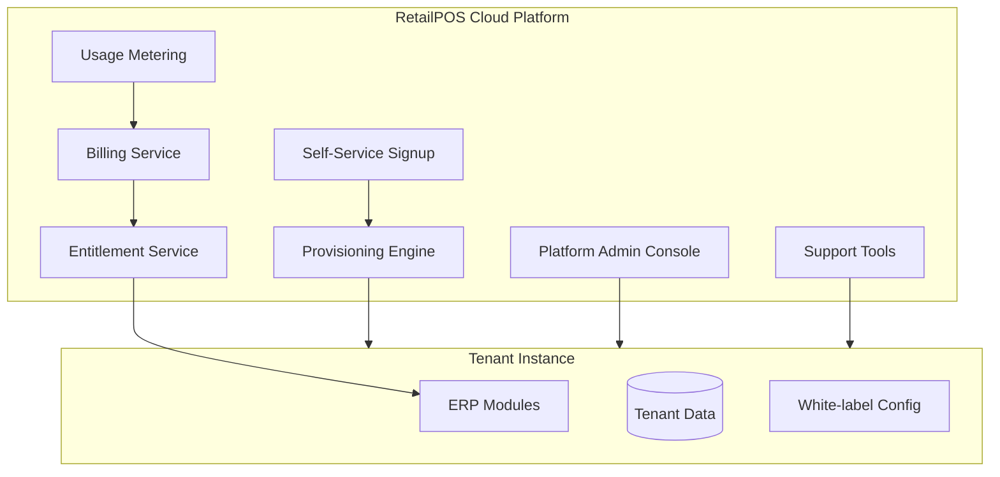
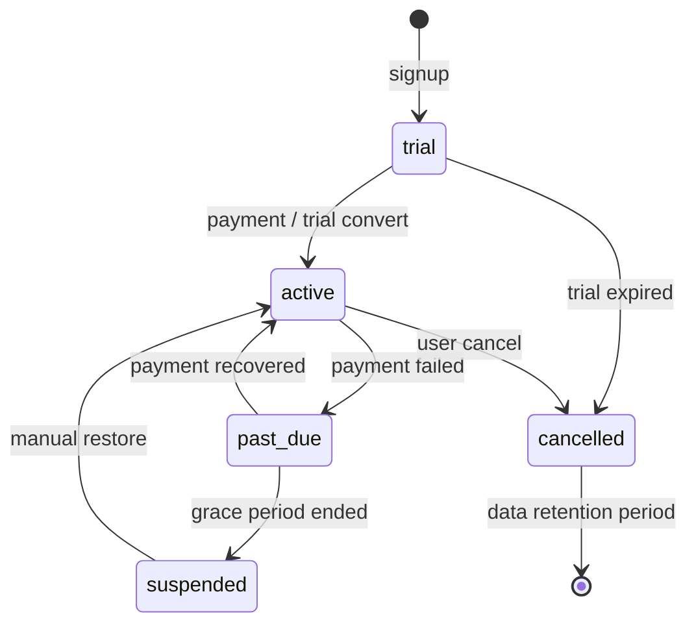

# Volume 6 — SaaS Platform

**Blueprint:** RetailPOS Enterprise v1.0  
**Statut:** Draft

---

## 1. Objectif

Spécifier la **plateforme SaaS** elle-même : provisioning tenants, abonnements, facturation, entitlements, white-label, et console d'administration plateforme — distincte des modules ERP métier.

---

## 2. Composants plateforme



---

## 3. Tenant Lifecycle

### 3.1 États tenant



| Statut | Accès ERP | Données |
|--------|-----------|---------|
| `trial` | Complet (limité) | Conservées |
| `active` | Selon plan | Conservées |
| `past_due` | Lecture seule | Conservées |
| `suspended` | Bloqué | Conservées |
| `cancelled` | Bloqué | Rétention 30 j → archive |

### 3.2 Provisioning flow

| Étape | Action | Automatisé |
|-------|--------|------------|
| 1 | Signup form (email, org name, country) | ✅ |
| 2 | Email verification | ✅ |
| 3 | Créer `tenants` row + UUID + slug | ✅ |
| 4 | Seed données défaut (plan comptable, 1 store, 1 admin) | ✅ |
| 5 | Créer subscription trial 14 j | ✅ |
| 6 | Redirect onboarding wizard | ✅ |
| 7 | Webhook `tenant.provisioned` | ✅ |

**Fichier cible :** `includes/Platform/Services/TenantProvisioningService.php`

### 3.3 Onboarding wizard (tenant)

| Step | Contenu |
|------|---------|
| 1 | Infos entreprise (logo, adresse, devise) |
| 2 | Premier magasin (nom, adresse) |
| 3 | Inviter équipe (emails) |
| 4 | Config fiscale (TVA %) |
| 5 | Premier produit ou import CSV |
| 6 | Lancer POS (tutorial) |

---

## 4. Plans & Entitlements

### 4.1 Modèle de données

Voir Volume 3 : `subscription_plans`, `tenant_subscriptions`, `modules_json`.

### 4.2 Structure `modules_json`

```json
{
  "pos": true,
  "inventory": true,
  "cash_registers": false,
  "manager": false,
  "warehouse": false,
  "accounting": false,
  "api_access": false,
  "max_stores": 1,
  "max_users": 5,
  "max_products": 500,
  "max_sales_per_month": 1000,
  "offline_hours": 24,
  "white_label": false,
  "support_tier": "email"
}
```

### 4.3 EntitlementService

```php
interface EntitlementServiceInterface
{
    public function hasModule(int $tenantId, string $module): bool;
    public function getLimit(int $tenantId, string $metric): ?int;
    public function getUsage(int $tenantId, string $metric): int;
    public function assertModule(int $tenantId, string $module): void; // throws 403
}
```

**Enforcement points :**
- Menu sidebar (hide modules)
- API middleware `EntitlementMiddleware`
- Cron usage check (soft limit warning → hard block)

---

## 5. Billing & Payments

### 5.1 Fournisseurs

| Provider | Usage | Région |
|----------|-------|--------|
| **Stripe** | Cartes, SEPA, subscriptions | Global |
| **Paystack** | Afrique | NG, GH, ZA, etc. |
| **Mobile Money** | Orange, MTN, Wave | UEMOA, CEMAC |
| Facture manuelle | Enterprise | Sur devis |

### 5.2 Modèle facturation

| Type | Description |
|------|-------------|
| Recurring | Mensuel / annuel par plan |
| Usage-based | SMS, API calls, extra stores |
| One-time | Onboarding premium, migration |

### 5.3 Tables billing

```sql
CREATE TABLE billing_events (
    id BIGINT UNSIGNED AUTO_INCREMENT PRIMARY KEY,
    tenant_id BIGINT UNSIGNED NOT NULL,
    type ENUM('invoice','payment','refund','failed') NOT NULL,
    amount DECIMAL(12,2) NOT NULL,
    currency CHAR(3) NOT NULL,
    external_id VARCHAR(128) NULL,
    metadata_json JSON NULL,
    created_at DATETIME NOT NULL DEFAULT CURRENT_TIMESTAMP
);

CREATE TABLE usage_metrics (
    id BIGINT UNSIGNED AUTO_INCREMENT PRIMARY KEY,
    tenant_id BIGINT UNSIGNED NOT NULL,
    metric VARCHAR(64) NOT NULL,
    period DATE NOT NULL,
    value BIGINT UNSIGNED NOT NULL DEFAULT 0,
    UNIQUE KEY uk_usage (tenant_id, metric, period)
);
```

### 5.4 Webhooks billing

| Event | Action |
|-------|--------|
| `invoice.paid` | `tenant.status = active` |
| `invoice.payment_failed` | `past_due` + email |
| `subscription.deleted` | `cancelled` + schedule purge |

---

## 6. Platform Admin Console

### 6.1 Portail

**Path cible :** `public/platform/`  
**Auth :** `platform_users` table — séparé des users tenant

### 6.2 Fonctionnalités

| Feature | Description |
|---------|-------------|
| Tenant list | Recherche, filtres statut/plan |
| Tenant detail | Usage, billing, users count, stores |
| Impersonate | Login as tenant admin (audit obligatoire) |
| Suspend / restore | Actions manuelles support |
| Plan override | Entitlements custom Enterprise |
| System health | Queue depth, error rate, DB size |
| Feature flags | Activer beta par tenant |
| Announcements | Bannière maintenance globale |

### 6.3 Impersonation (support)

```
Platform support → "Login as" tenant admin
→ Session flag impersonating=true
→ Banner visible "Support mode"
→ All actions audit logged with platform_user_id
```

---

## 7. White-label & Branding

### 7.1 Configurable par tenant (plan Enterprise)

| Élément | Stockage |
|---------|----------|
| Logo | S3 `tenant/{id}/branding/logo.png` |
| Favicon | S3 |
| Couleur accent | `tenants.settings_json.theme.accent` |
| Nom produit | `settings_json.brand.name` |
| Domaine custom | DNS CNAME → `tenant.retailpos.cloud` |
| Email from | `noreply@client.com` (SPF/DKIM) |

### 7.2 Injection UI

Déjà partiel via `data-theme-accent` et `theme-head.php` :

```php
// Extension cible bootstrap.php
$tenantBranding = TenantSettings::branding(TenantScope::id());
$themeAccent = $tenantBranding['accent'] ?? '#2563eb';
```

---

## 8. Multi-région & domaines

| URL type | Exemple |
|----------|---------|
| Platform | `app.retailpos.cloud` |
| Tenant subdomain | `acme.retailpos.cloud` |
| Custom domain | `erp.acme.sn` |
| API | `api.retailpos.cloud/v2/` |
| Status page | `status.retailpos.cloud` |

**TenantResolver** (Vol. 2) : hostname → `tenants.slug`

---

## 9. Usage metering

### Métriques trackées

| Métrique | Incrément | Plan limit |
|----------|-----------|------------|
| `sales.count` | Chaque vente | Par mois |
| `api.calls` | Chaque request API | Par mois |
| `sms.sent` | Notification SMS | Pay-per-use |
| `stores.count` | Nombre magasins | Par plan |
| `users.count` | Utilisateurs actifs | Par plan |
| `storage.bytes` | Uploads | Par plan |

**Worker :** Agrégation nightly → `usage_metrics` → alerte 80 % / 100 %

---

## 10. SLA & Support tiers

| Tier | Disponibilité | Support | Temps réponse |
|------|---------------|---------|---------------|
| Starter | 99.5 % | Email | 48 h |
| Business | 99.9 % | Email + chat | 24 h |
| Enterprise | 99.95 % | Dédié + phone | 4 h |

---

## 11. Feature Flags

Table `feature_flags` :

```sql
CREATE TABLE feature_flags (
    key_name VARCHAR(64) PRIMARY KEY,
    description VARCHAR(255),
    default_enabled TINYINT(1) DEFAULT 0
);

CREATE TABLE tenant_feature_flags (
    tenant_id BIGINT UNSIGNED,
    key_name VARCHAR(64),
    enabled TINYINT(1),
    PRIMARY KEY (tenant_id, key_name)
);
```

Usage : beta modules, A/B tests, rollout progressif.

---

## 12. Checklist plateforme SaaS

- [ ] Tables `tenants`, `subscription_plans`, `billing_events`
- [ ] `TenantProvisioningService`
- [ ] Signup + email verify flow
- [ ] Stripe integration + webhooks
- [ ] `EntitlementService` + middleware
- [ ] Platform admin console MVP
- [ ] Usage metering worker
- [ ] White-label settings UI
- [ ] Tenant subdomain routing
- [ ] Status page & incident process

---

*Volume 6 — RetailPOS Enterprise Blueprint v1.0*
