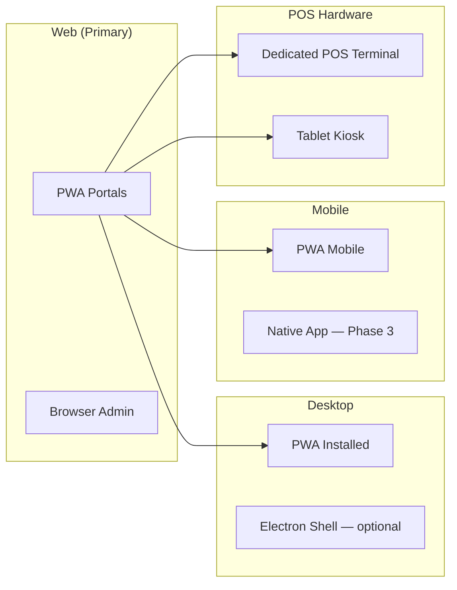
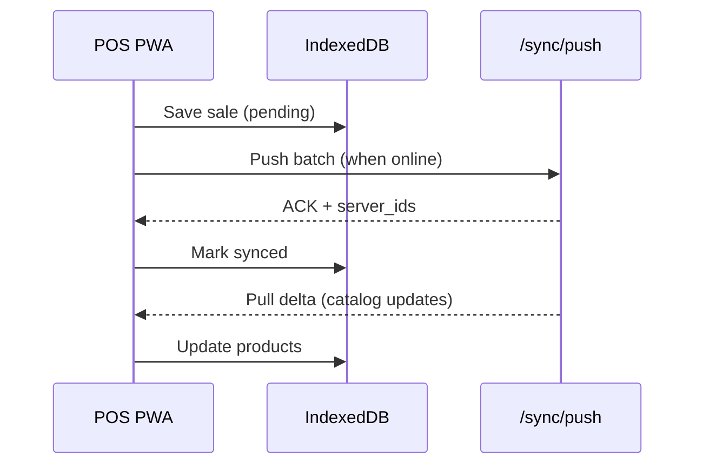

# Volume 8 — PWA, Desktop & Mobile Strategy

**Blueprint:** RetailPOS Enterprise v1.0  
**Statut:** Draft

---

## 1. Objectif

Définir la stratégie **multi-canal** : PWA offline, applications desktop, et mobile — en s'appuyant sur l'existant (`manifest.json`, service workers, sync) et en planifiant l'évolution SaaS.

---

## 2. État actuel

| Composant | Fichier | Statut |
|-----------|---------|--------|
| Web manifest | `public/manifest.json` | ✅ Basique |
| Service worker POS | `assets/js/service-worker.js` | ✅ POS shell cache |
| SW alternatif | `assets/js/sw.js` | ⚠️ Dupliqué |
| Offline fallback | `offline/fallback.html` | ✅ |
| Sync API | `SyncController` | ✅ |
| Offline JS modules | `*-offline.js` (warehouse, accounting) | ⚠️ Partiel |
| i18n offline | `public/js/i18n-indexeddb.js` | ✅ |
| PWA portails | warehouse, cash-registers, accounting layouts | ✅ manifest link |

### 2.1 Manifest actuel

```json
{
  "name": "Modern African Retail POS",
  "short_name": "RetailPOS",
  "start_url": "./index.html",
  "display": "standalone",
  "theme_color": "#2563eb"
}
```

**Problèmes :** `start_url` incorrect ; pas de scope par portail ; icônes limitées.

---

## 3. Stratégie multi-canal



### 3.1 Principe : PWA-first

| Canal | Priorité | Raison |
|-------|----------|--------|
| **PWA** | P0 | Un codebase, offline, pas d'app store |
| **Responsive web** | P0 | Admin/manager sur desktop |
| **Desktop wrapper** | P2 | Kiosk mode, USB devices |
| **Native mobile** | P3 | Si PWA insuffisant (push iOS, hardware) |

---

## 4. PWA par portail

### 4.1 Manifests séparés

| Portail | Manifest | start_url | theme_color |
|---------|----------|-----------|-------------|
| POS | `manifest-pos.json` | `/cashier/pos.php` | `#2563eb` |
| Cashier | `manifest-cashier.json` | `/cashier/dashboard.php` | `#2563eb` |
| Warehouse | `manifest-warehouse.json` | `/warehouse/` | `#0d9488` |
| Accounting | `manifest-accounting.json` | `/accounting/` | `#059669` |
| Caisses | `manifest-cash-registers.json` | `/cash-registers/` | `#2563eb` |

### 4.2 Service Worker strategy

| Cache | Stratégie | Contenu |
|-------|-----------|---------|
| **App shell** | CacheFirst | HTML, CSS, JS core |
| **API catalog** | StaleWhileRevalidate | Products, categories |
| **API mutations** | NetworkOnly + queue | Sales, sync push |
| **Images** | CacheFirst (TTL 7d) | Product images |
| **i18n** | CacheFirst | Translation bundles |

### 4.3 Offline capabilities par module

| Module | Offline read | Offline write | Sync |
|--------|--------------|---------------|------|
| POS | ✅ Catalog | ✅ Sales | ✅ Push queue |
| Inventory | ⚠️ View | ❌ | — |
| Warehouse | ⚠️ Scanner lookup | ❌ | Roadmap |
| Accounting | ❌ | ❌ | — |
| Manager | ❌ | ❌ | — |

**Cible POS offline :** 72 h autonomie, sync auto à reconnexion.

---

## 5. IndexedDB schema (offline)

### 5.1 Stores proposés

```javascript
// retailpos-offline DB
{
  products:       { keyPath: 'id', indexes: ['sku', 'barcode'] },
  customers:      { keyPath: 'id' },
  pending_sales:  { keyPath: 'local_id', indexes: ['status'] },
  sync_queue:     { keyPath: 'id', indexes: ['created_at'] },
  i18n_cache:     { keyPath: 'key' },
  config:         { keyPath: 'key' }  // tenant, store, tax rates
}
```

### 5.2 Sync protocol



---

## 6. UX offline

### 6.1 Indicateurs visuels (MUST)

| État | UI |
|------|-----|
| Online | Dot vert discret |
| Offline | Banner orange « Mode hors ligne » |
| Syncing | Spinner + « Synchronisation... » |
| Sync error | Banner rouge + retry button |
| Pending count | Badge « 3 ventes en attente » |

### 6.2 Connection API

```javascript
// assets/js/shared/connectivity.js — cible
export const Connectivity = {
  isOnline: () => navigator.onLine,
  onChange: (cb) => { ... },
  pendingSyncCount: async () => { ... },
  forcSync: async () => { ... }
};
```

---

## 7. Desktop strategy

### 7.1 Option A — PWA installée (recommandé)

- Chrome/Edge « Install app » sur POS terminal
- Kiosk mode : `--kiosk --app=https://acme.retailpos.cloud/cashier/pos.php`
- Windows assigned access / Chrome kiosk

### 7.2 Option B — Electron wrapper (Phase 2)

| Avantage | Cas d'usage |
|----------|-------------|
| USB serial (balance, drawer) | Hardware avancé |
| Auto-start OS | Terminal dédié |
| Offline certifié | Environnements contrôlés |

**Structure :**
```
desktop/
├── electron-main.js
├── preload.js          # Bridge USB/print
└── package.json
```

### 7.3 Impression thermique

| Méthode | Plateforme |
|---------|------------|
| Browser print | Tous (actuel) |
| ESC/POS via WebUSB | Chrome desktop |
| Native bridge (Electron) | Windows/Linux |
| Cloud print agent | Enterprise |

Fichier existant : `receipts/templates/thermal-80mm.php`

---

## 8. Mobile strategy

### 8.1 PWA mobile (Phase 1)

| Portail | Mobile priority | Usage terrain |
|---------|-----------------|---------------|
| POS | ⚠️ Tablette only | Pas phone (UX) |
| Warehouse | ✅ Phone + tablette | Scanner, réception |
| Manager | ✅ Phone | Approbations, supervision |
| Inventory | ✅ Tablette | Comptage |

### 8.2 Native app (Phase 3 — si nécessaire)

**Déclencheurs :**
- iOS push notifications insuffisantes en PWA
- Scanner Bluetooth natif requis
- Performance catalogue > 10 000 SKU

**Stack candidat :** React Native ou Flutter (API v2 JWT)

### 8.3 App warehouse mobile (MVP PWA)

Pages prioritaires mobile :
- `barcode_scanner.php`
- `receive_stock.php`
- `pick_list.php`
- `notifications.php`
- `approve_transfer.php`

CSS : `warehouse-portal.css` déjà responsive — audit `@media` requis.

---

## 9. Device management (Enterprise)

### 9.1 POS Terminal enrollment

| Étape | Action |
|-------|--------|
| 1 | Admin génère device code |
| 2 | Terminal entre code → auto-configure tenant/store |
| 3 | Device enregistré dans `registered_devices` |
| 4 | Remote wipe capability |

```sql
CREATE TABLE registered_devices (
    id BIGINT UNSIGNED AUTO_INCREMENT PRIMARY KEY,
    tenant_id BIGINT UNSIGNED NOT NULL,
    store_id BIGINT UNSIGNED NULL,
    device_type ENUM('pos','warehouse_scanner','manager') NOT NULL,
    name VARCHAR(128),
    fingerprint VARCHAR(128) NOT NULL,
    last_seen_at DATETIME,
    revoked_at DATETIME NULL
);
```

---

## 10. Push notifications

| Plateforme | Méthode | Statut |
|------------|---------|--------|
| Web (Chrome) | Service Worker Push API | Roadmap |
| iOS Safari | PWA push (iOS 16.4+) | Roadmap |
| Android | FCM via PWA | Roadmap |
| Fallback | SMS / WhatsApp | ✅ Partiel |

**Use cases push :** Approval pending, sync complete, low stock alert.

---

## 11. Performance budgets

| Métrique | Cible POS (3G) | Cible Admin (4G) |
|----------|----------------|------------------|
| First Contentful Paint | < 1.5 s | < 2 s |
| Time to Interactive | < 3 s | < 4 s |
| JS bundle POS | < 500 KB gzip | < 800 KB |
| Catalog load (1000 SKU) | < 2 s | < 3 s |

---

## 12. Checklist PWA/Mobile

- [ ] Corriger `manifest.json` start_urls
- [ ] Manifests par portail
- [ ] Unifier service workers
- [ ] `connectivity.js` shared module
- [ ] Offline UI indicators POS
- [ ] IndexedDB schema standardisé
- [ ] 72 h offline test suite
- [ ] Warehouse mobile UX audit
- [ ] Device enrollment flow
- [ ] Web Push notifications MVP

---

*Volume 8 — RetailPOS Enterprise Blueprint v1.0*
