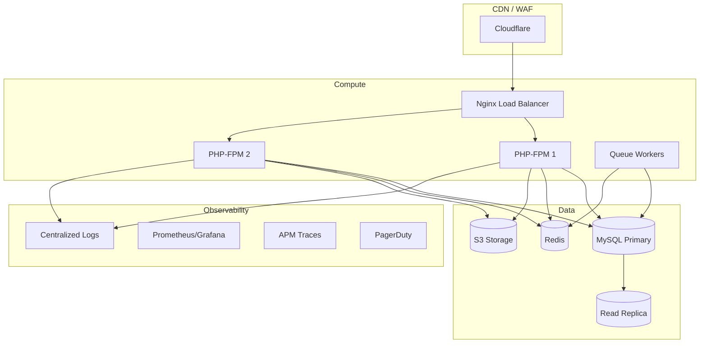
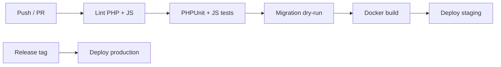
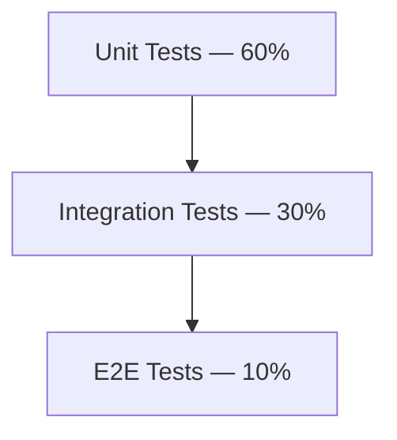

# Volume 9 — DevOps, Testing & Deployment

**Blueprint:** RetailPOS Enterprise v1.0  
**Statut:** Draft

---

## 1. Objectif

Définir l'infrastructure de déploiement, l'intégration continue, la stratégie de tests, et l'observabilité pour RetailPOS Cloud en production SaaS.

---

## 2. Environnements

| Env | URL | Base données | Usage |
|-----|-----|--------------|-------|
| **Local** | `localhost/Pos system/public/` | `pos_system_db` local | Dev XAMPP |
| **Dev** | `dev.retailpos.cloud` | `retailpos_dev` | Intégration équipe |
| **Staging** | `staging.retailpos.cloud` | `retailpos_staging` | QA, demos |
| **Production** | `app.retailpos.cloud` | `retailpos_prod` | Clients |
| **Sandbox** | `sandbox.retailpos.cloud` | Éphémère | API partners |

### 2.1 Règles environnements

- Production : deploy depuis `main` tag only
- Staging : auto-deploy `main` chaque merge
- Secrets : jamais en repo ; `.env` par environnement
- Données prod : jamais copiées vers dev sans anonymisation

---

## 3. Infrastructure cible



### 3.1 Stack recommandé (Phase 1)

| Composant | Technologie |
|-----------|-------------|
| OS | Ubuntu 22.04 LTS |
| Web server | Nginx |
| PHP | 8.2+ PHP-FPM |
| Database | MySQL 8.0 |
| Cache/Queue | Redis 7 |
| Storage | AWS S3 / MinIO |
| CDN/WAF | Cloudflare |
| Containers | Docker (optionnel Phase 1) |
| Orchestration | Docker Compose → K8s (Phase 2) |

---

## 4. Containerisation

### 4.1 Dockerfile (proposition)

```dockerfile
FROM php:8.2-fpm-alpine
RUN apk add --no-cache nginx supervisor \
    && docker-php-ext-install pdo_mysql redis
COPY . /var/www/retailpos
WORKDIR /var/www/retailpos
EXPOSE 80
CMD ["supervisord", "-c", "/etc/supervisord.conf"]
```

### 4.2 Docker Compose (dev)

```yaml
services:
  web:
    build: .
    ports: ["8080:80"]
    env_file: .env
    depends_on: [mysql, redis]
  mysql:
    image: mysql:8.0
    environment:
      MYSQL_DATABASE: pos_system_db
  redis:
    image: redis:7-alpine
  worker:
    build: .
    command: php tools/worker.php
    depends_on: [mysql, redis]
```

---

## 5. CI/CD Pipeline

### 5.1 GitHub Actions workflow



### 5.2 Pipeline stages

| Stage | Outils | Bloque merge |
|-------|--------|--------------|
| Lint PHP | PHP_CodeSniffer, PHPStan level 5 | ✅ |
| Lint JS | ESLint | ✅ |
| Unit tests | PHPUnit | ✅ |
| Integration tests | PHPUnit + test DB | ✅ |
| Security scan | `composer audit`, Semgrep | ✅ |
| Migration test | `php tools/migrate.php --dry-run` | ✅ |
| E2E | Playwright (critical paths) | ⚠️ Nightly |
| Deploy staging | SSH / Docker | Auto main |
| Deploy prod | Manual approval | Tag v* |

### 5.3 Fichiers CI cibles

```
.github/
├── workflows/ci.yml
├── workflows/deploy-staging.yml
└── workflows/deploy-production.yml
```

---

## 6. Stratégie de tests

### 6.1 Pyramide



### 6.2 Couverture par domaine

| Domaine | Type | Priorité | Outil |
|---------|------|----------|-------|
| TenantScope | Unit | P0 | PHPUnit |
| PermissionService | Unit | P0 | PHPUnit |
| SalesService | Unit + Integration | P0 | PHPUnit |
| StoreScope → TenantScope | Unit | P0 | PHPUnit |
| API v2 endpoints | Integration | P0 | PHPUnit + HTTP tests |
| Cross-tenant isolation | Security | P0 | PHPUnit |
| Sync push/pull | Integration | P1 | PHPUnit |
| POS checkout | E2E | P1 | Playwright |
| Accounting auto-post | Integration | P1 | PHPUnit |
| WMS transfer flow | E2E | P2 | Playwright |

### 6.3 Tests cross-tenant (critique SaaS)

```php
// tests/Security/CrossTenantTest.php
public function test_user_cannot_access_other_tenant_sale(): void
{
    $tenantA = $this->createTenant();
    $tenantB = $this->createTenant();
    $saleB = $this->createSale($tenantB);

    $this->actingAs($this->createUser($tenantA));
    $response = $this->get("/api/v2/sales/{$saleB->id}");

    $response->assertStatus(404); // not 403 — no leak
}
```

### 6.4 Structure tests

```
tests/
├── Unit/
│   ├── Platform/TenantScopeTest.php
│   ├── Auth/PermissionServiceTest.php
│   └── Sales/SalesServiceTest.php
├── Integration/
│   ├── Api/SalesApiTest.php
│   └── Sync/SyncPushTest.php
├── Security/
│   └── CrossTenantTest.php
└── E2E/
    ├── pos-checkout.spec.ts
    └── warehouse-receive.spec.ts
```

**Outil :** PHPUnit 10 + Playwright

---

## 7. Migrations en production

### 7.1 Process

| Étape | Action |
|-------|--------|
| 1 | Migration testée staging |
| 2 | Backup DB production |
| 3 | Maintenance window si ALTER lourd |
| 4 | `php tools/migrate.php` |
| 5 | Smoke tests automatisés |
| 6 | Rollback plan si échec |

### 7.2 Règles migrations SaaS

- Jamais de `DELETE` sans `WHERE tenant_id` en data migration
- ALTER TABLE : utiliser `pt-online-schema-change` si table > 1M rows
- Migrations structure et data séparées
- Chaque migration : up + down script

---

## 8. Observabilité

### 8.1 Logging

| Niveau | Destination | Rétention |
|--------|-------------|-----------|
| Application | JSON → stdout → Loki/ELK | 90 jours |
| Access | Nginx logs | 30 jours |
| Audit | `audit_logs` table | 2 ans |
| Security | Dedicated security index | 2 ans |

**Format log structuré :**
```json
{
  "timestamp": "2026-06-20T10:00:00Z",
  "level": "error",
  "tenant_id": "uuid",
  "user_id": 42,
  "message": "Sale creation failed",
  "context": { "sale_id": null, "error": "..." }
}
```

### 8.2 Métriques (Prometheus)

| Métrique | Type |
|----------|------|
| `http_requests_total` | Counter |
| `http_request_duration_seconds` | Histogram |
| `active_tenants` | Gauge |
| `sync_queue_depth` | Gauge |
| `sales_per_minute` | Counter |
| `db_connections_active` | Gauge |

### 8.3 Alertes

| Alerte | Seuil | Sévérité |
|--------|-------|----------|
| API error rate > 1 % | 5 min | P2 |
| API latency P95 > 1 s | 5 min | P2 |
| DB connections > 80 % | 1 min | P1 |
| Disk > 85 % | 1 min | P1 |
| Sync queue > 1000 | 10 min | P2 |
| Payment webhook failures | 3 consecutive | P1 |

### 8.4 Status page

- `status.retailpos.cloud` (Better Uptime / Instatus)
- Composants : API, POS, Web Portals, Sync, Notifications

---

## 9. Sécurité ops

| Pratique | Détail |
|----------|--------|
| Secrets | AWS Secrets Manager / Vault |
| TLS | Let's Encrypt auto-renew |
| WAF | Cloudflare OWASP rules |
| DB access | Private subnet, no public |
| SSH | Key-only, bastion host |
| Backups | Daily full + binlog continuous |
| DR drill | Quarterly restore test |
| Dependency updates | Weekly Dependabot |

---

## 10. Déploiement zéro-downtime

### 10.1 Stratégie

1. Deploy nouvelle version sur worker 2
2. Health check `/health`
3. Switch load balancer traffic
4. Deploy worker 1
5. Run migrations (backward compatible)

### 10.2 Health endpoint

```php
// public/health.php
{
  "status": "ok",
  "version": "1.2.3",
  "checks": {
    "database": "ok",
    "redis": "ok",
    "queue": "ok"
  }
}
```

---

## 11. Local dev setup

```bash
# Quickstart cible
git clone ...
cp .env.example .env
docker compose up -d
php tools/migrate.php
php seed.php --tenant=demo
# → http://localhost:8080/public/login.php
```

**Fichier à créer :** `.env.example` avec toutes variables documentées.

---

## 12. Checklist DevOps

- [ ] `.env.example` + secrets manager
- [ ] Dockerfile + docker-compose.yml
- [ ] GitHub Actions CI pipeline
- [ ] PHPUnit setup + TenantScope tests
- [ ] Playwright E2E POS checkout
- [ ] `tools/migrate.php` CLI
- [ ] `public/health.php`
- [ ] Centralized logging
- [ ] Prometheus metrics endpoint
- [ ] Backup automation + restore runbook
- [ ] Status page

---

*Volume 9 — RetailPOS Enterprise Blueprint v1.0*
